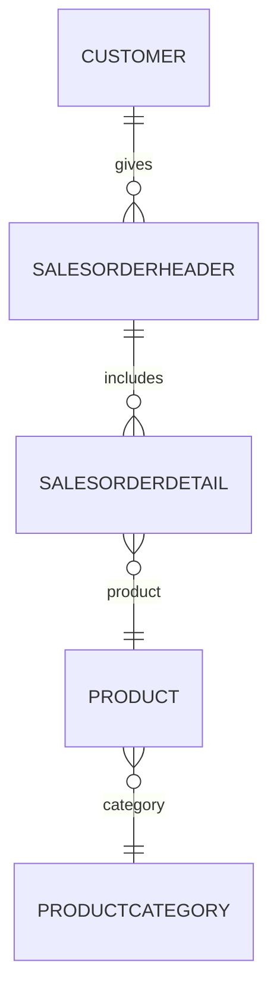

# AdventureWorks 5 Tablo Dependency Diyagramı

**Description:**
- A customer can place more than one order (SalesOrderHeader).
- Each order can have multiple details (SalesOrderDetail).
- Each detail is associated with a product (Product).
- Each product belongs to a category (ProductCategory).
